# 🖥️ POS System

A complete Point of Sale system built for small to medium-sized businesses. This system supports inventory management, sales tracking, staff role-based access control, cash flow monitoring, and database backup/restore.

---

## 🔐 User & Account Management
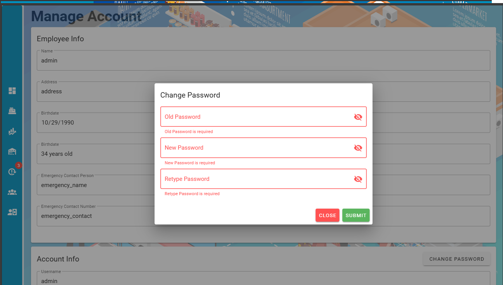
- **Change Password** – Allows users to securely change their password.

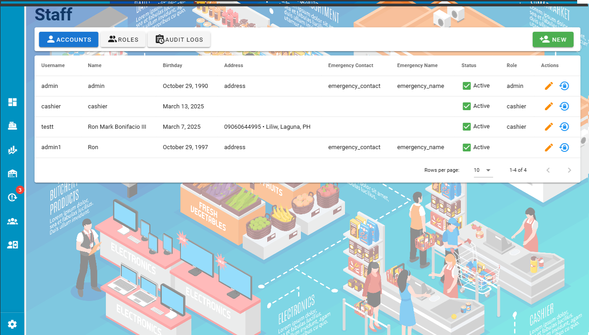
- **Staff Management** – Add, edit, or remove staff. Manage user roles and permissions.

---

## 💵 Sales & Cash Register

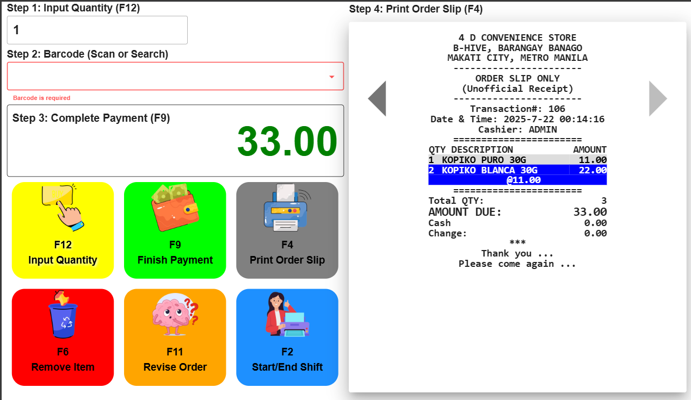
- **Cash Register** – Interface for processing and recording sales transactions.

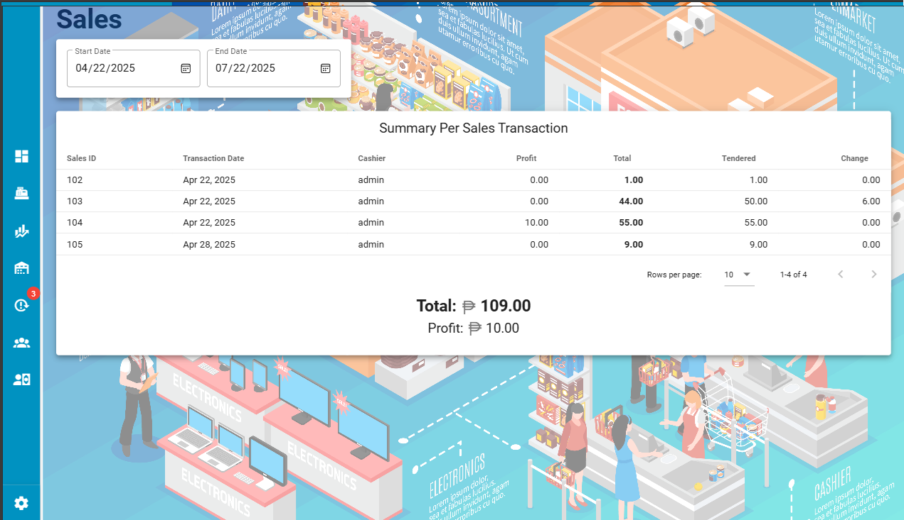
- **Sales Logs** – Displays a full history of transactions from the cash register.

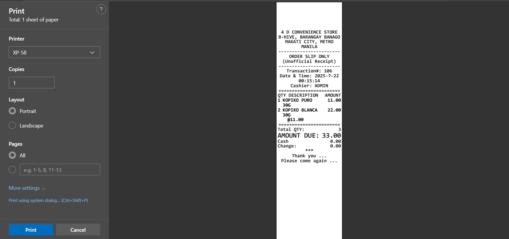
- **Sample Receipt Preview** – Preview the actual receipt layout before printing.

---

## 💰 Cash Monitoring

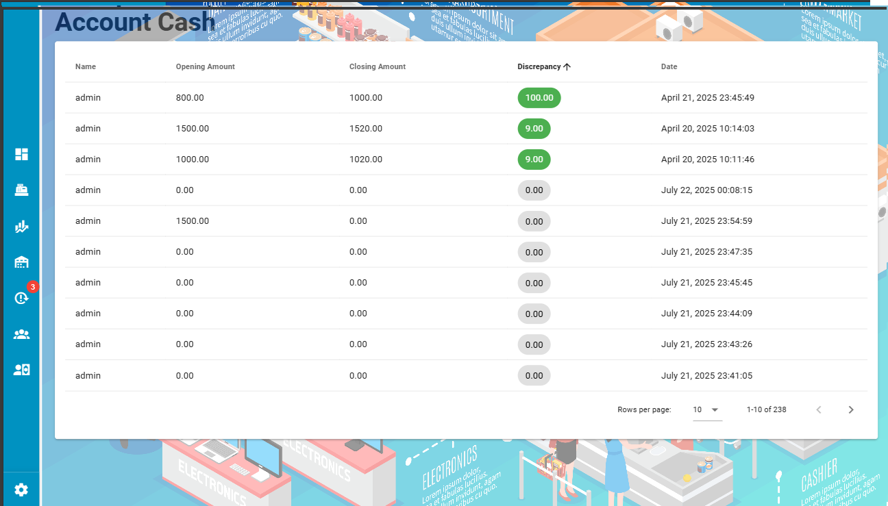
- **Account Cash Logs** – Monitor cash movements and log staff discrepancies.

- **Cash Register Flow** – Track opening and closing balances and denominations.

---

## 📦 Inventory Management

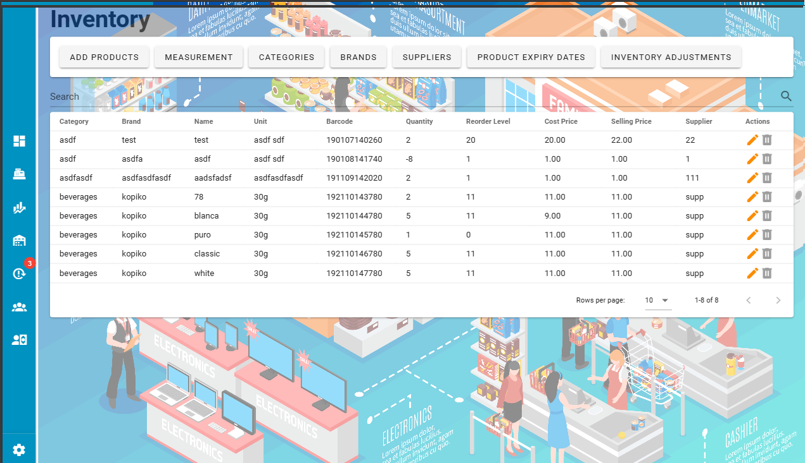
- **Inventory Dashboard** – Overview of all products with filtering and search.

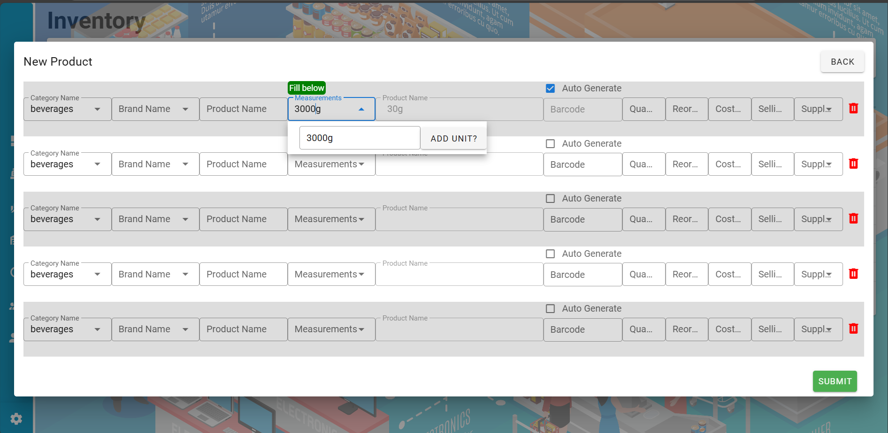
- **Add Product (Bulk & Single)** – Add multiple products in one submit or individually.

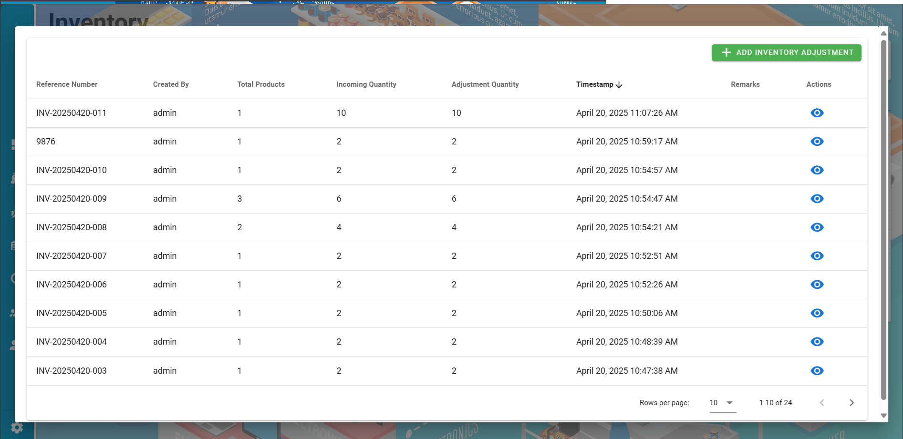
- **Inventory Adjustments** – Modify stock levels with reference/tracking numbers.

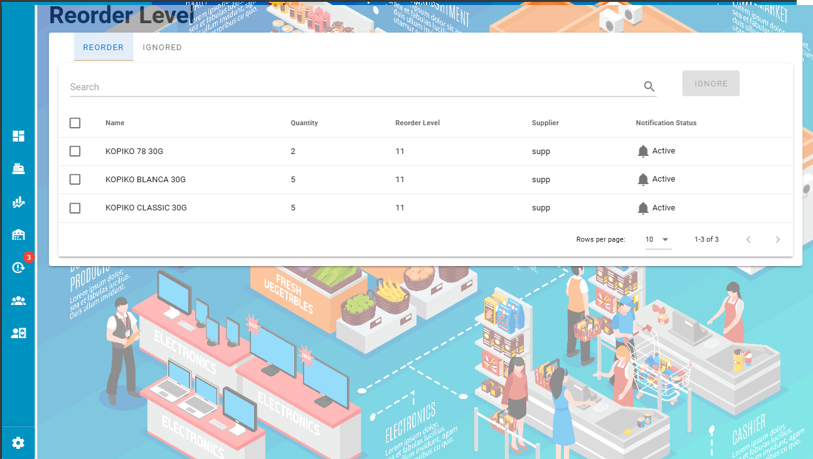
- **Reorder Level Alerts** – Notifications for products below threshold levels.

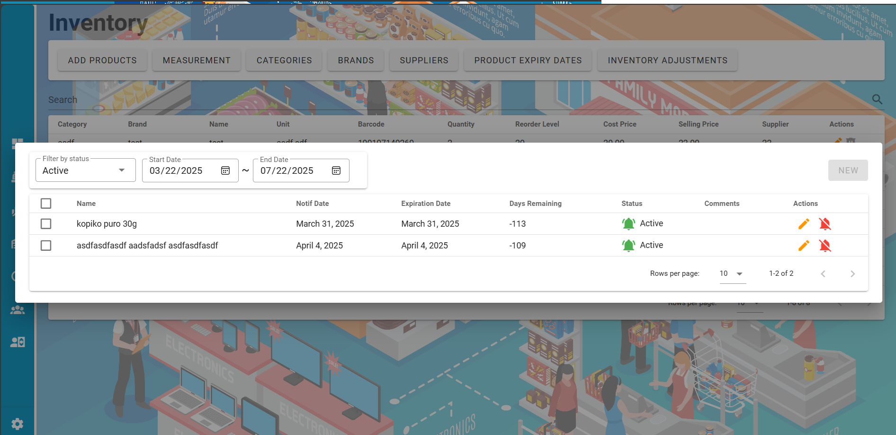
- **Product Expiry Monitoring** – Assign expiry dates and receive alerts.

---

## 🛠️ System Utilities

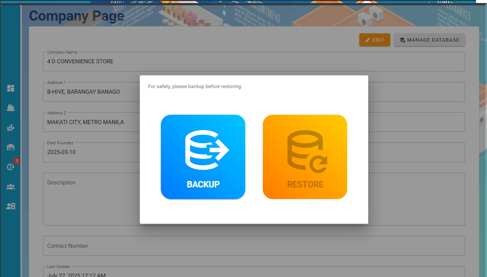
- **Backup & Restore Database** – Export or import the entire system database with one click.

---

## 🖥️ Demo

📹 

---

## 🛠️ Tech Stack

| Layer     | Technology             |
|-----------|------------------------|
| Frontend  | Vue.js + Vuetify       |
| Backend   | Node.js (Express)      |
| Database  | MySQL / MariaDB        |
| Others    | jsPDF for receipts, backup/restore system, product alerts |

---

## 🔗 GitHub Repositories

- **Frontend (Vue.js + Vuetify)**
  🔗 [View on GitHub](https://github.com/ron029/posFe)

- **Backend (Node.js + Express + MySQL)**
  🔗 [View on GitHub](https://github.com/ron029/4dpos)

---

## 🧩 Database Schema – POS System

Below is the Entity Relationship Diagram (ERD) representing the data structure of the POS application:

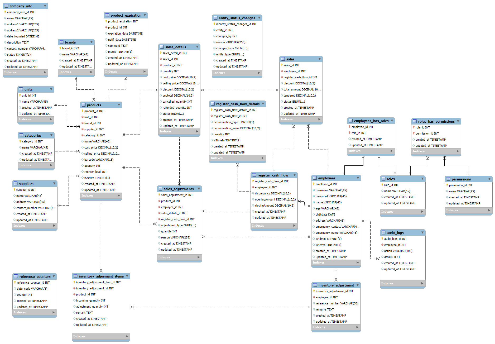

---

## 📁 Key Modules & Tables

### 🔹 Products & Inventory
- `products` – Core product info: pricing, barcode, quantity.
- `categories`, `brands`, `units`, `suppliers` – Lookup tables.
- `product_expiration` – Tracks product expiry dates.
- `inventory_adjustment`, `inventory_adjustment_items` – Records of quantity changes.
- `reorder_level` – Triggers stock alerts when threshold is low.

### 🔹 Sales
- `sales` – Sales transactions.
- `sales_details` – Individual items in each transaction.
- `sales_adjustments` – Refunds or corrections.
- `sample_receipt` – Used in frontend for visual receipt previews.

### 🔹 Cash Management
- `register_cash_flow` – Daily opening/closing balances.
- `register_cash_flow_details` – Denomination breakdown.
- `account_cash_logs` – Movement and discrepancies.

### 🔹 Users & Permissions
- `employees`, `roles`, `permissions`
- `employees_has_roles`, `roles_has_permissions` – RBAC (Role-Based Access Control)

### 🔹 Utilities
- `reference_counters` – Running number generator.
- `audit_logs` – Activity logs for actions performed.
- `entity_status_changes` – Tracks changes in entity status (e.g., adjustments, sales, etc.)

---

## 💡 Development Notes

- **Normalization**: Schema is normalized for data integrity and efficiency.
- **Security**: Role-based access control (RBAC) ensures secure operations. *(Passwords should be hashed.)*
- **Traceability**: Audit logs and reference numbers ensure traceability.
- **Maintainability**: Modular schema using lookup tables for easy updates.
- **Extendability**: Can be extended to include features like loyalty programs, product bundles, or e-commerce integration.

---

## 📩 Contact

For questions or collaboration inquiries, feel free to contact me at:
📧 `bonifacioronmark@gmail.com`

---

